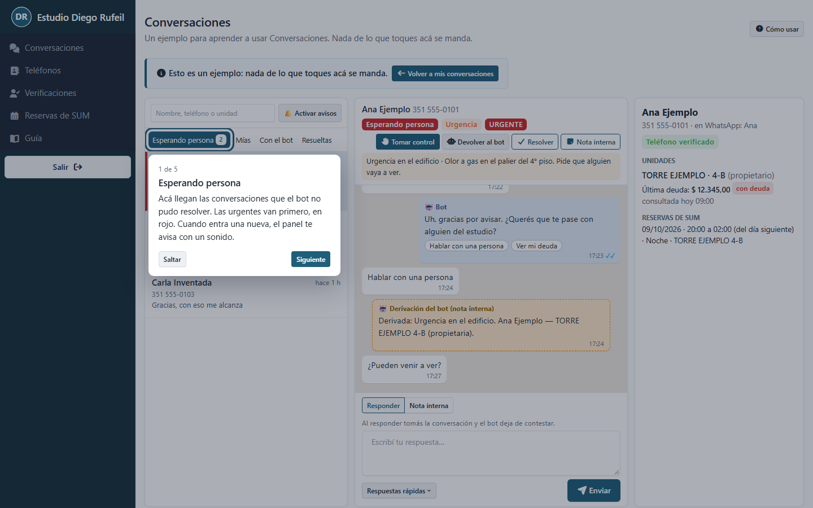
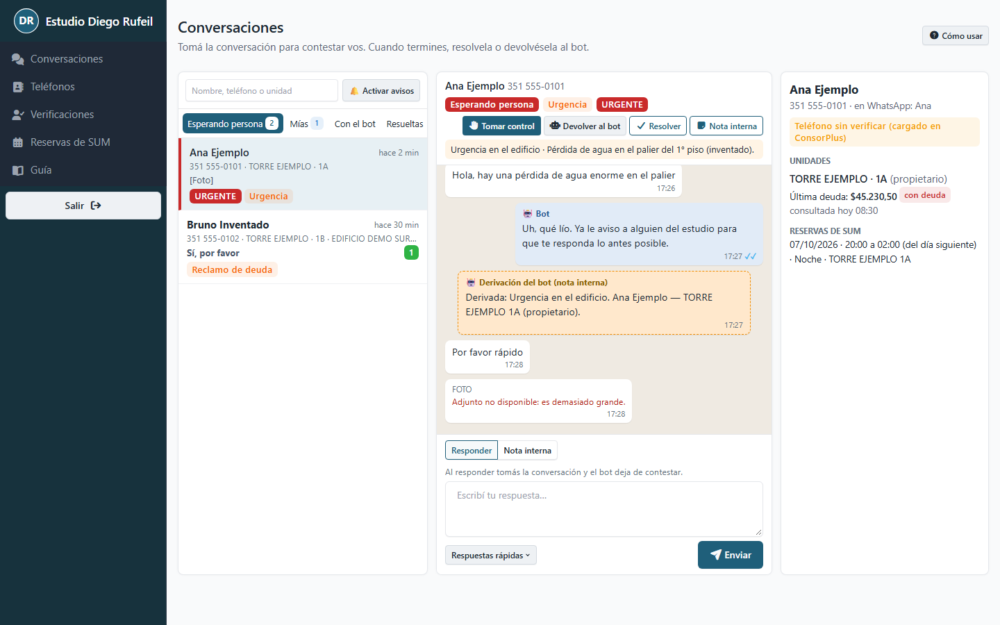
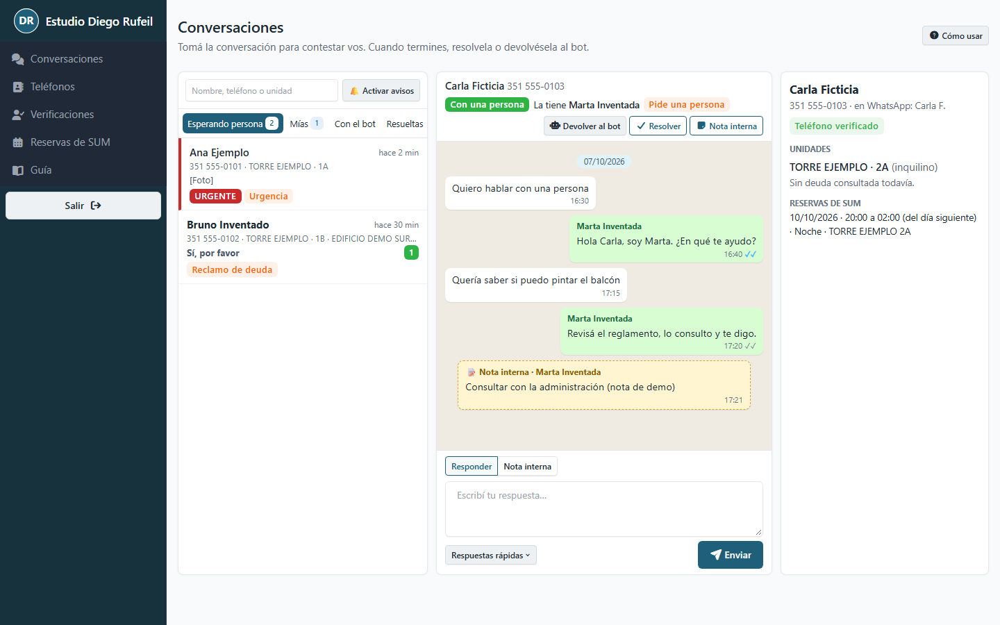
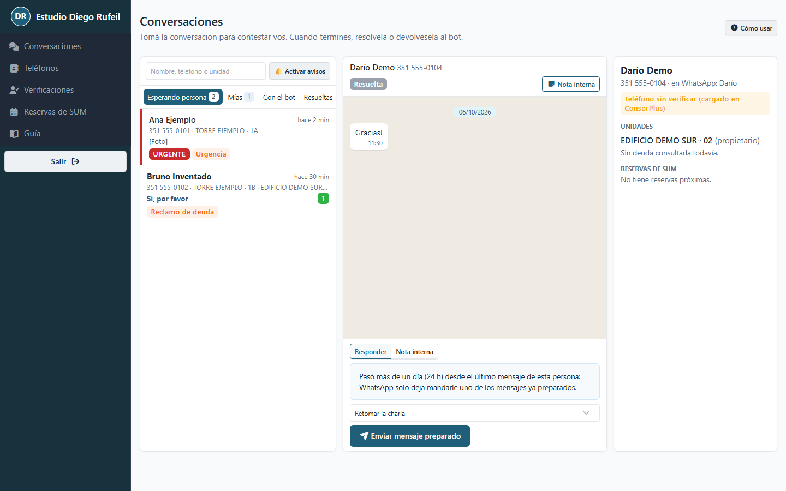
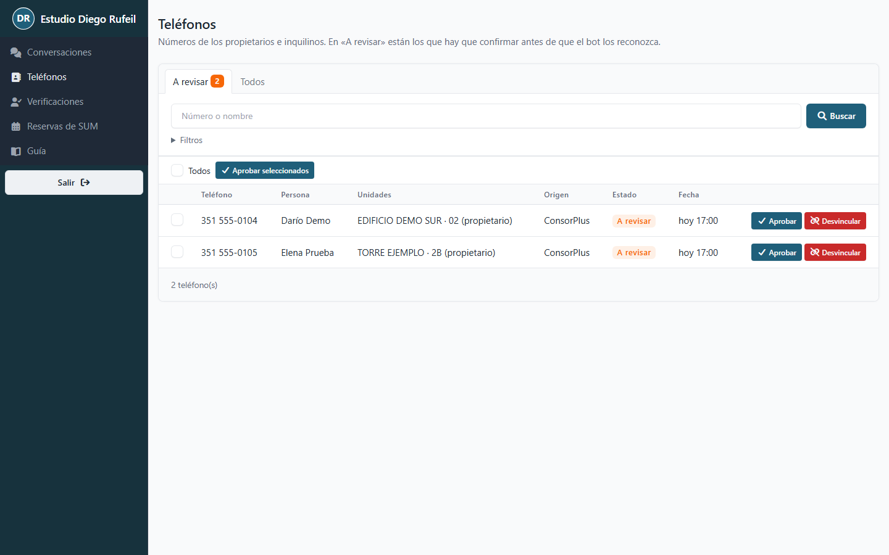
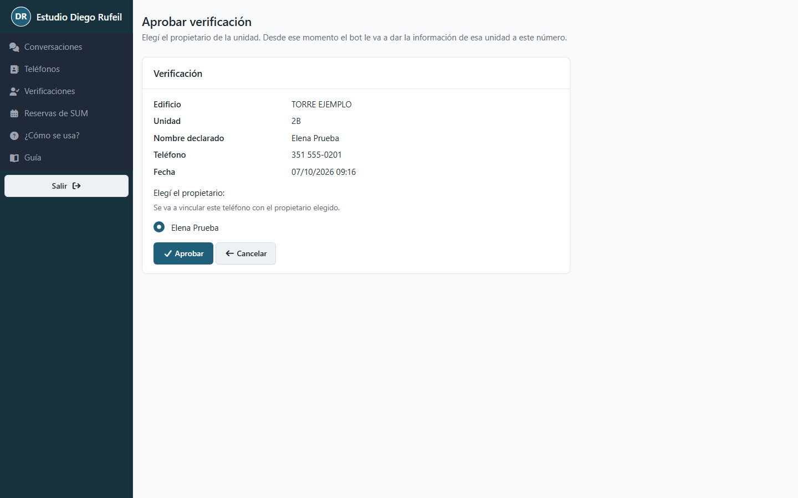
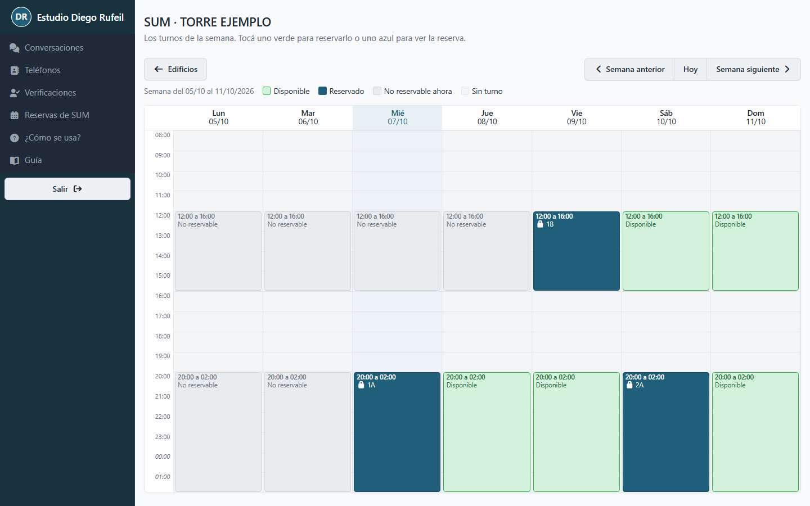
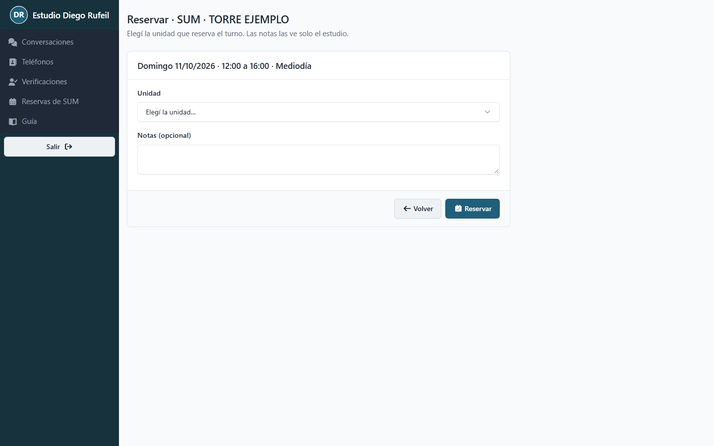
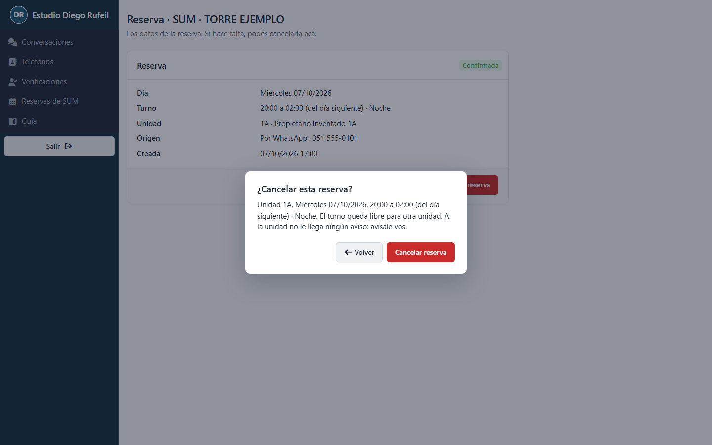

# Guía del panel

Para ver un recorrido rápido por la pantalla, tocá **Cómo usar** arriba de
**Conversaciones**. Se abre una conversación de ejemplo: lo que toques ahí no se manda a nadie.

Esta guía explica las tareas de todos los días en el panel del estudio. Las capturas usan
nombres y números inventados.

Si en algún momento no sabés qué hacer en una pantalla, leé la línea gris que está debajo del
título: dice para qué sirve.

## 1. Atender una conversación que necesita a alguien

El bot contesta solo la mayoría de los mensajes. Cuando no puede (la persona pide hablar con
alguien, hay un reclamo o una urgencia), la conversación pasa a **Esperando persona** y el panel
te avisa con un sonido.

1. Entrá a **Conversaciones**. La pestaña **Esperando persona** muestra cuántas hay. Las
   urgentes están primero, marcadas en rojo.
2. Tocá la conversación para abrirla. Arriba vas a ver por qué la mandó el bot y un resumen.
   A la derecha están los datos de la persona: sus unidades, su última deuda y sus reservas.
3. Tocá **Tomar control**. Desde ese momento el bot no le contesta más y la conversación
   queda en **Mías**.
4. Escribí tu respuesta y tocá **Enviar**. Si querés, usá **Respuestas rápidas** para pegar un
   texto guardado.
5. Cuando terminaste, elegí una de dos:
   - **Resolver**: la conversación pasa a **Resueltas**. Si la persona vuelve a escribir, la
     atiende el bot.
   - **Devolver al bot**: si el bot puede seguir solo (por ejemplo, para darle la deuda o el
     código de pago).

Para dejar algo anotado que la persona no ve, usá **Nota interna**. Las notas quedan en
amarillo en la conversación y las ven todas las del estudio.

## 2. Responder cuando pasó más de un día

WhatsApp no deja escribirle libremente a alguien cuyo último mensaje fue hace más de un día
(24 horas). En ese caso, en lugar de la caja para escribir vas a ver un aviso y una lista de
mensajes ya preparados.

1. Abrí la conversación.
2. Elegí el mensaje preparado que corresponda (por ejemplo, «Retomar la charla»).
3. Tocá **Enviar mensaje preparado**.
4. Cuando la persona conteste, vas a poder escribirle normalmente.

## 3. Aprobar un teléfono

Algunos números vienen de ConsorPlus incompletos y el sistema tuvo que adivinar una parte. Hasta
que alguien los confirme, el bot no los usa.

1. Entrá a **Teléfonos**. Se abre en **A revisar** si hay alguno.
2. Fijate que el número y la persona coincidan con lo que sabés (por ejemplo, con la ficha de
   ConsorPlus).
3. Si está bien, tocá **Aprobar**. Si hay varios correctos, marcalos y tocá **Aprobar
   seleccionados**.
4. Si el número no es de esa persona, tocá **Desvincular**. El panel te va a pedir que lo
   confirmes y te explica qué pasa.

## 4. Aprobar o rechazar una verificación

Cuando alguien escribe por WhatsApp diciendo que es propietario de una unidad que no tiene email
cargado, el bot no puede confirmarlo solo y te lo deja en **Verificaciones**.

1. Entrá a **Verificaciones**. Cada renglón dice el edificio, la unidad, el nombre que dio la
   persona y su teléfono.
2. Si sabés que es el propietario, tocá **Aprobar** y elegí su nombre de la lista. Desde ese
   momento el bot le da la información de esa unidad.
3. Si tenés dudas, tocá **Ver conversación** para leer lo que escribió.
4. Si no corresponde, tocá **Rechazar**. A la persona no le llega ningún aviso: si querés que
   sepa, escribile desde Conversaciones.

## 5. Reservar y cancelar el SUM

1. Entrá a **Reservas de SUM** y tocá **Planilla** en el edificio.
2. Los turnos verdes están libres; los azules, reservados; los grises no se pueden reservar en
   este momento (tocalos para ver por qué). Con las flechas cambiás de semana (en el celular,
   de día).
3. Para reservar, tocá un turno verde, elegí la unidad, agregá una nota si hace falta y tocá
   **Reservar**.
4. Si la unidad no cumple una regla (por ejemplo, ya reservó dos veces este mes), el panel te
   lo dice. Podés marcar **Reservar igual** si corresponde: queda registrado.
5. Para cancelar, tocá el turno azul y después **Cancelar reserva**. El turno queda libre. A la
   unidad no le llega ningún aviso: avisale vos.

## 6. Si algo sale raro

- **Un mensaje dice «No se entregó».** WhatsApp no lo pudo mandar (por ejemplo, el número ya
  no existe). Probá de nuevo más tarde o comunicate por otro medio.
- **No encuentro un teléfono.** Buscalo por una parte del nombre o por los últimos números, sin
  espacios. Fijate que no haya filtros aplicados.
- **Aparece «Esta sección es solo para administradores».** Esa pantalla no es para tu usuario.
  Si necesitás algo de ahí, pedíselo a un admin.
- **El bot le dio un dato mal a alguien.** Tomá la conversación, corregilo vos y dejá una nota
  interna contando qué pasó para que un admin lo revise.
- **No me deja reservar.** Leé el aviso: dice qué regla no se cumple. Si corresponde igual,
  marcá **Reservar igual**.
- **El panel no se actualiza o se ve raro.** Recargá la página. Si sigue igual, cerrá sesión
  con **Salir** y volvé a entrar.
